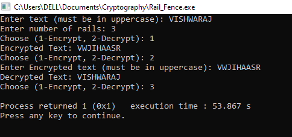

### Vishwaraj G.
### 212223220125
# Cryptography---19CS415-classical-techqniques
# Ex-1(d) Rail Fence Cipher
Rail Fence Cipher using with different key values

# AIM:

To develop a simple C program to implement Rail Fence Cipher.

## DESIGN STEPS:

### Step 1:

* Design of Rail Fence Cipher algorithnm 

### Step 2:

* Implementation using C or pyhton code

### Step 3:

* Testing algorithm with different key values. 
## ALGORITHM DESCRIPTION:
In the rail fence cipher, the plaintext is written downwards and diagonally on successive "rails" of an imaginary fence, then moving up when we reach the bottom rail. When we reach the top rail, the message is written downwards again until the whole plaintext is written out. The message is then read off in rows.

## PROGRAM:
```
#include <stdio.h>
#include <string.h>
#include <stdlib.h>

void railFenceEncrypt(char* text, int rails) {
    char rail[rails][strlen(text)];
    memset(rail, '\n', sizeof(rail));

    int row = 0, col = 0;
    int dir_down = 0;
    for (int i = 0; i < strlen(text); i++) {
        if (row == 0) dir_down = 1;
        if (row == rails - 1) dir_down = 0;

        rail[row][col++] = text[i];
        row += dir_down ? 1 : -1;
    }

    printf("Encrypted Text: ");
    for (int i = 0; i < rails; i++) {
        for (int j = 0; j < strlen(text); j++) {
            if (rail[i][j] != '\n')
                printf("%c", rail[i][j]);
        }
    }
    printf("\n");
}

void railFenceDecrypt(char* cipher, int rails) {
    char rail[rails][strlen(cipher)];
    memset(rail, '\n', sizeof(rail));

    int row = 0, col = 0;
    int dir_down = 0;

    for (int i = 0; i < strlen(cipher); i++) {
        if (row == 0) dir_down = 1;
        if (row == rails - 1) dir_down = 0;

        rail[row][col++] = '*';
        row += dir_down ? 1 : -1;
    }

    int index = 0;
    for (int i = 0; i < rails; i++) {
        for (int j = 0; j < strlen(cipher); j++) {
            if (rail[i][j] == '*' && index < strlen(cipher)) {
                rail[i][j] = cipher[index++];
            }
        }
    }

    row = 0; col = 0;
    dir_down = 0;
    printf("Decrypted Text: ");
    for (int i = 0; i < strlen(cipher); i++) {
        if (row == 0) dir_down = 1;
        if (row == rails - 1) dir_down = 0;

        if (rail[row][col] != '\n') {
            printf("%c", rail[row][col++]);
        }

        row += dir_down ? 1 : -1;
    }
    printf("\n");
}

int main() {
    char text[100];
    int rails, choice;

    printf("Enter text (must be in uppercase): ");
    fgets(text, sizeof(text), stdin);
    text[strcspn(text, "\n")] = 0;

    printf("Enter number of rails: ");
    scanf("%d", &rails);

    while (1) {
        printf("Choose (1-Encrypt, 2-Decrypt): ");
        scanf("%d", &choice);
        getchar();
        switch (choice) {
            case 1:
                railFenceEncrypt(text, rails);
                break;
            case 2:
                printf("Enter Encrypted text (must be in uppercase): ");
                fgets(text, sizeof(text), stdin);
                text[strcspn(text, "\n")] = 0;
                railFenceDecrypt(text, rails);
                break;
            default:
                exit(1);
        }
    }
    return 0;
}
```
## OUTPUT:

## RESULT:
The program is executed successfully